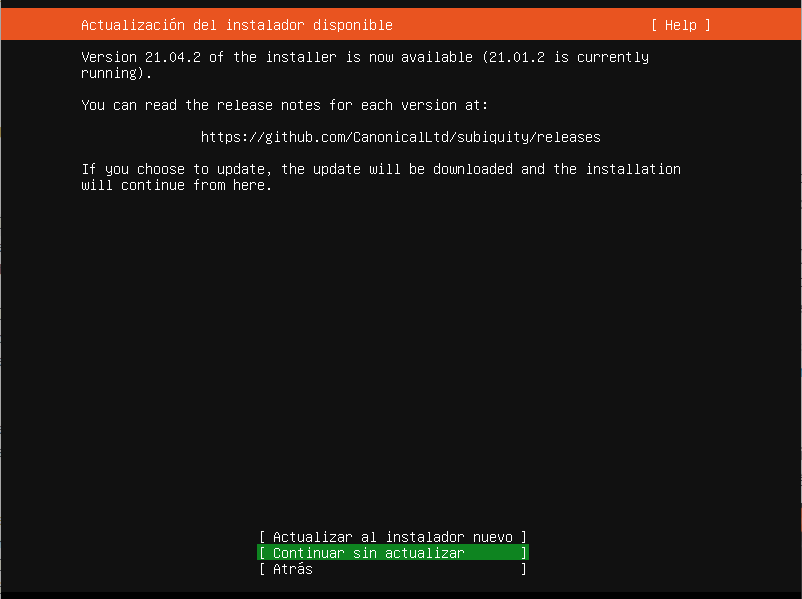
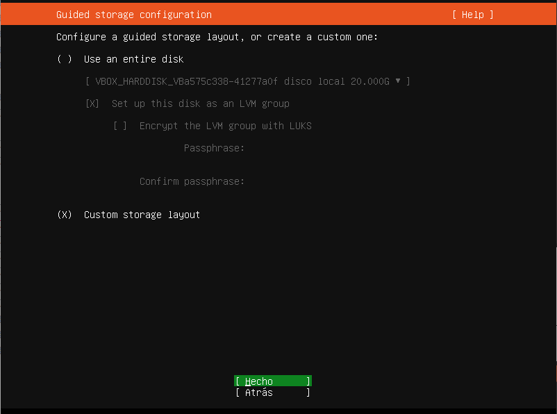

# Instalación de Ubuntu Server 20.04 LTS

## Consideraciones previas

### Requerimientos de instalación

- CPU: 1 Ghz o superior.
- RAM: 1 GB o más.
- Disk: al menos 2.5 GB.

### Diferencias y similitudes entre la versión Server y Desktop

Tanto Ubuntu Server como Ubuntu Desktop usan el mismo repositorio, lo que facilita instalar aplicaciones en ambas ediciones, pero la diferencia más grande está en que en la versión Server no se instala un entorno gráfico (ni nada que tenga que ver con un entorno de escritorio), además la versión server incluye algunos procesos propios de un servidor como servicios de archivo / impresión, alojamiento web, alojamiento de correo electrónico, etc.

Ante cualquier duda sobre el proceso de instalación, siempre podremos consultar la [documentación oficial de Ubuntu][1].

## Selección del Lenguaje
Una vez que el sistema arranque la instalación de Ubuntu Server, lo primero que el asistente de instalación nos solicitará es que seleccionemos el lenguaje:

## Actualizar el instalador (opcional)
Si existiera una versión más reciente del instalador podriamos seleccionar la opción **Actualizar al instalador nuevo**, pero este paso es opcional, por lo que podríamos **Continuar sin actualizar**.

## Elegir distribución del teclado
El siguiente paso en el asistente de instalación es elegir qué distribución de teclado es la que tenemos, para ello podemos simplemente elegirla o (en el caso de desconecerla) podríamos también usar un asistente que nos ayude a reconocer nuestra distribución de teclado.

## Configuración de red
En este apartado se nos autoconfigurará la interfaz sólo si nuestro router tiene DCHP y si la conexión es cableada, en el caso de WiFi tendremos que hacer un paso más (conectarnos a la red).

En nuestro caso, la interfaz de red se autoconfiguró pero vamos a asignarle una IP estática (paso opcional pero recomendado para un servidor, aunque también es posible realizar este paso luego de haber instalado el sistema).

### Configurar una IP estática

Para hacerlo necesitamos primero tendremos que seleccionar la interfaz que deseamos modificar

Ahora seleccionaremos que el método de IPv4 sea manual

Ahora completaremos todos los campos, el siguiente sería un ejemplo

## Configuración del Proxy (opcional)
Sólo completar este campo si es que tenemos una configuración de proxy en nuestra red.

## Configuración del servidor espejo
El asistente de instalación intentará geolocalizar nuestra IP para seleccionarnos el servidor espejor de paquetes más cercano a nuestra zona, si deseas puedes introducir otra URL aquí.

## Alcenamiento
Ahora debemos configurar nuestros discos.

Podemos seleccionar la primera opción si es que sólo vamos a dejar Ubuntu Server como único sistema operativo.

En el caso en que necesitemos intalarlo Ubuntu Server junto a otro sistema operativo (ejemplo Windows 10) debemos seleccionar la segunda opción:

Ahora debemos seleccionar el disco sobre el que vamos a trabajar las particiones.

Ahora debemos agregar las particiones que necesitemos:

Cuando creamos la primera partición el asistente automáticamente nos va a crear una partición de arranque `bios_group`, en este caso sólo necesitamos una única partición (seleccionamos todo el disco) y ponemos como punto de montaje el directorio raíz `/`.

Por último sólo nos resta confirmar los cambios realizados en el/los disco/s para escribir los cambios y continuar al siguiente paso.

## Configuración del Perfil

Nos resta rellenar los datos con nuestro nombre de usuario, nombre del servidor y cuenta de usuario.

## Agregar servicio SSH
Este paso es opcional pero recomendado si lo que queremos será controlar nuestro servidor remotamente, habiltamos la opción y confirmamos.

## Agregar servicios o características a nuestro servidor (opcional)
En esta ventana podremos seleccionar que servicios deseamos añadir a nuestro servidor (lo podremos instalar luego)

## Progreso de la instalación
Ahora sólo nos resta esperar que la instalación de Ubuntu Server finalice

## Referencias

- [Guía de Instalación de Ubuntu Server][1]

[1]: https://ubuntu.com/server/docs/installation